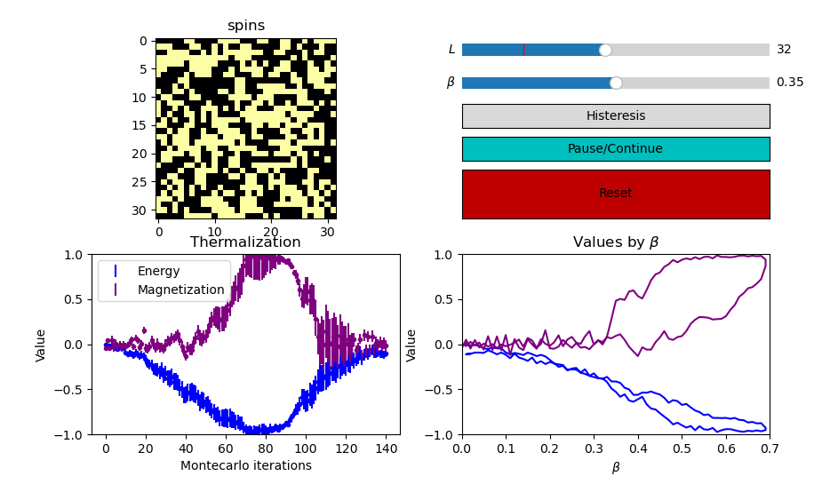

# 2D Ising Model
A simple 2D Ising model simulation with Python. From [(Wikipedia)](https://en.wikipedia.org/wiki/Ising_model).

>   The Ising model, named after the physicists Ernst Ising and Wilhelm Lenz, is a mathematical model of ferromagnetism in statistical mechanics. The model consists of discrete variables that represent magnetic dipole moments of atomic "spins" that can be in one of two states (+1 or −1). The spins are arranged in a graph, usually a lattice (where the local structure repeats periodically in all directions), allowing each spin to interact with its neighbors. Neighboring spins that agree have a lower energy than those that disagree; the system tends to the lowest energy but heat disturbs this tendency, thus creating the possibility of different structural phases. The model allows the identification of phase transitions as a simplified model of reality. The two-dimensional square-lattice Ising model is one of the simplest statistical models to show a phase transition.

## How to use
Simply run [main.py](main.py). Enjoy!

## Configuration
All configurable variables are in the main file:
*   `L_min` : min latice size
*   `L_initial` : starting latice size
*   `L_max` : max latice size
*   `beta_min` : min beta (max temperature)
*   `beta_max` : max beta (min temperature, over 0.8 is enough)
*   `delta_beta` : change in beta while doing histeresis and precision when selected